# RabbitMQ DLX - Mermaid Diagrams

This document contains visual diagrams for the RabbitMQ Dead Letter Exchange (DLX) implementation.

## Complete Message Flow with DLX

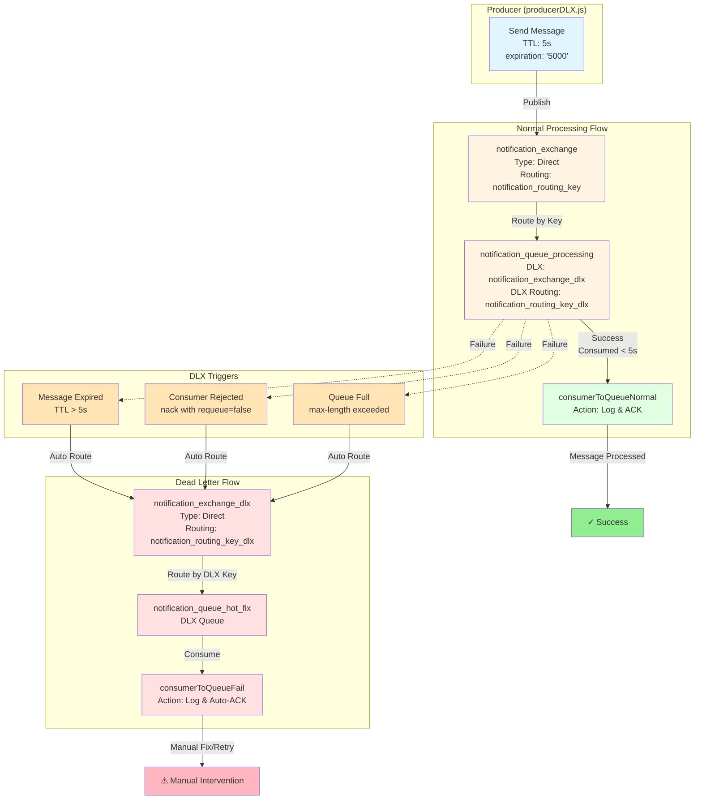

---

## Sequence Diagram - Normal Flow (Success)

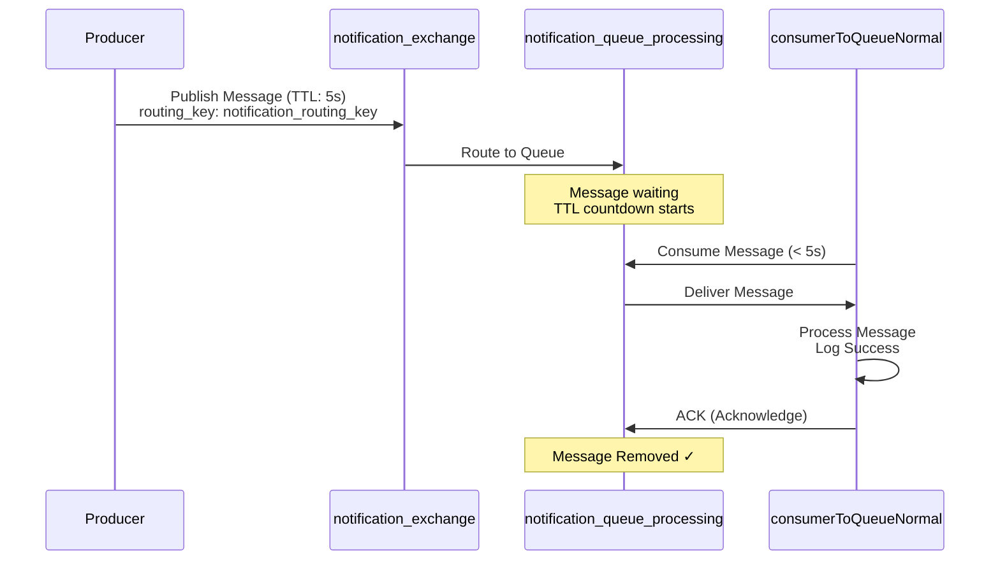

---

## Sequence Diagram - DLX Flow (Message Expired)

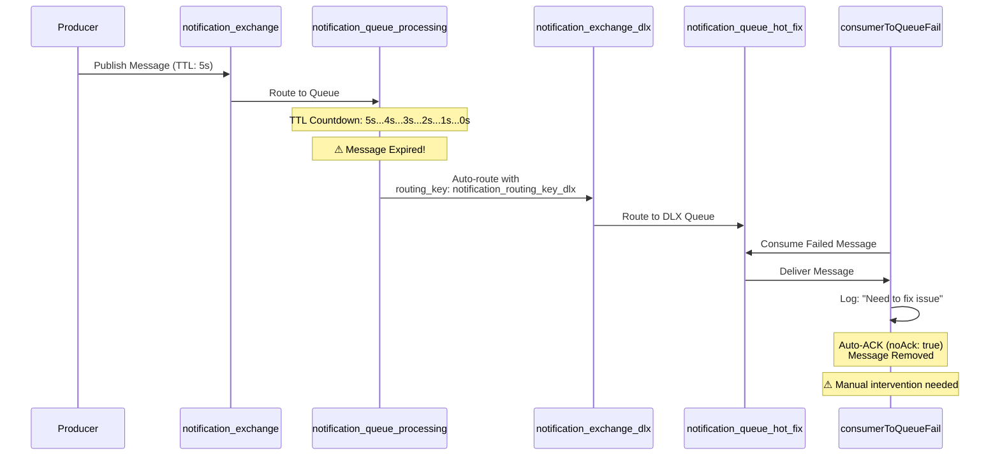

---

## Sequence Diagram - DLX Flow (Consumer Rejection)

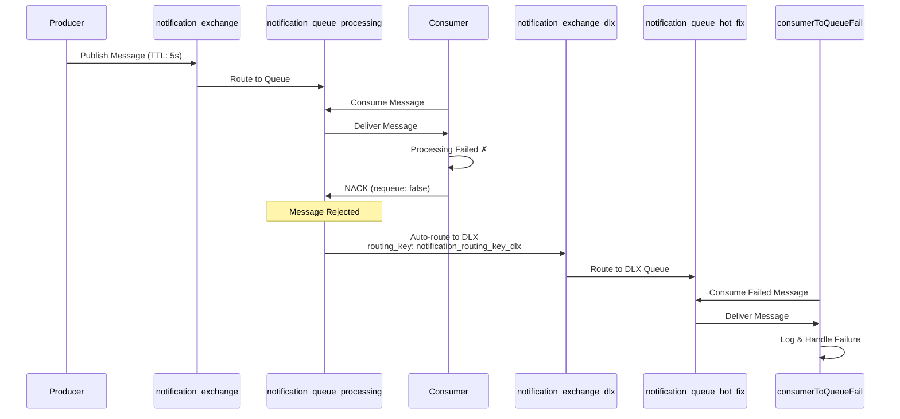

---

## Component Relationship Diagram

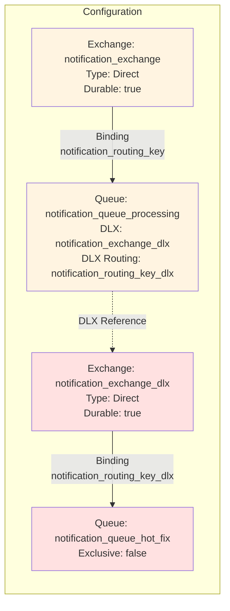

---

## State Diagram - Message Lifecycle

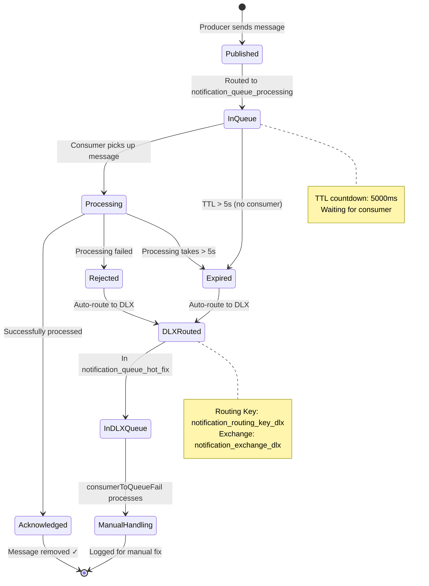

---

## TTL Timeline Diagram

```mermaid
gantt
    title Message TTL Lifecycle (5 seconds)
    dateFormat X
    axisFormat %Ls

    section Normal Flow
    Message Published           :milestone, m1, 0, 0
    Message in Queue (TTL 5s)   :active, task1, 0, 5000
    Consumer Processes (< 5s)   :crit, task2, 2000, 500
    Message ACK & Removed       :milestone, m2, 2500, 0

    section DLX Flow
    Message Published           :milestone, m3, 6000, 0
    Message in Queue (TTL 5s)   :active, task3, 6000, 5000
    No Consumer (Idle)          :task4, 6000, 5000
    TTL Expired at 5s           :milestone, m4, 11000, 0
    Auto-route to DLX           :crit, task5, 11000, 200
    Message in DLX Queue        :task6, 11200, 2000
    DLX Consumer Processes      :crit, task7, 11200, 500
```

---

## Architecture Overview - C4 Style

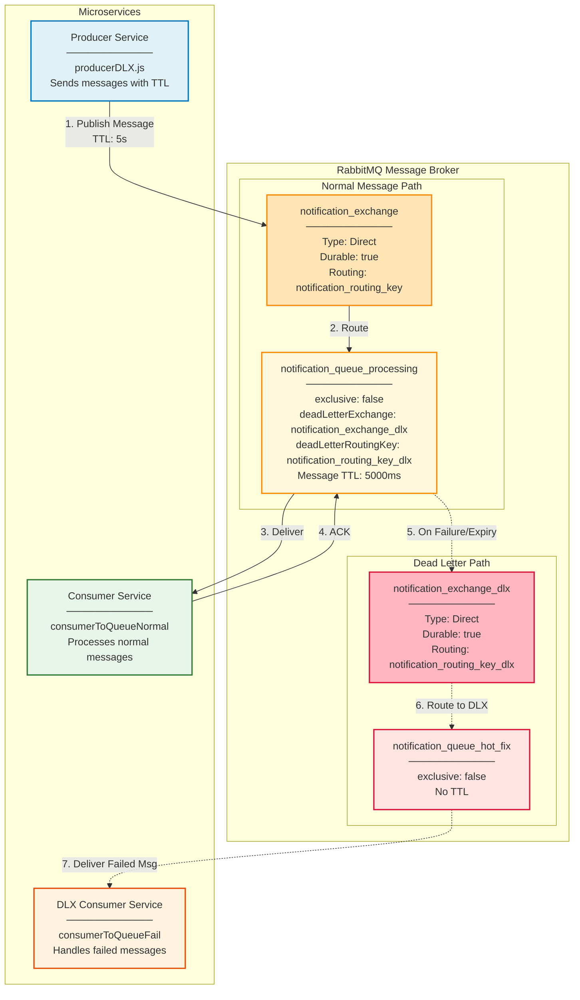

---

## Detailed Routing Flow

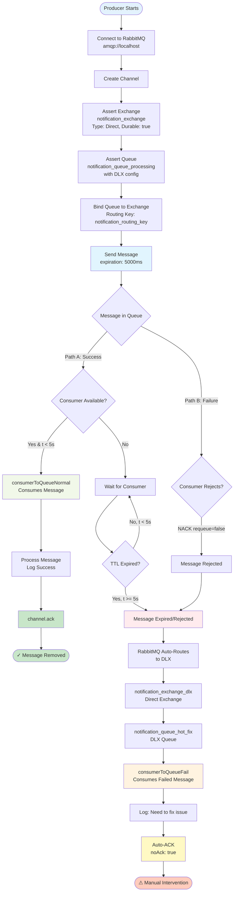

---

## Error Handling Flow

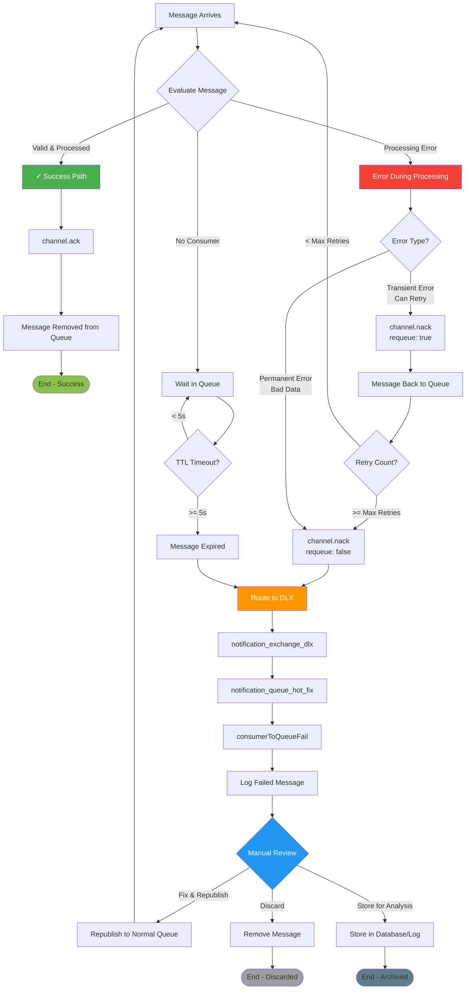

---

## Queue Configuration Map

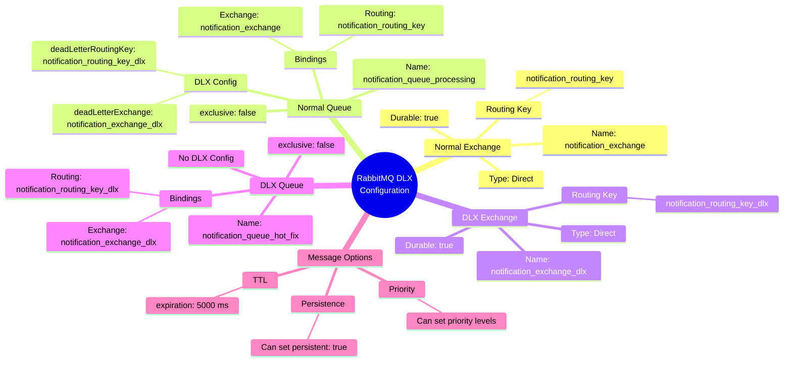

---

## Consumer Interaction Diagram

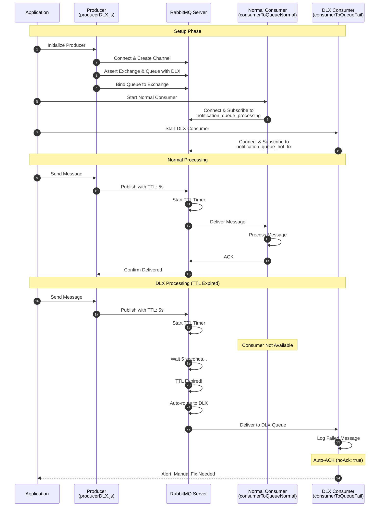

---

## Deployment Architecture

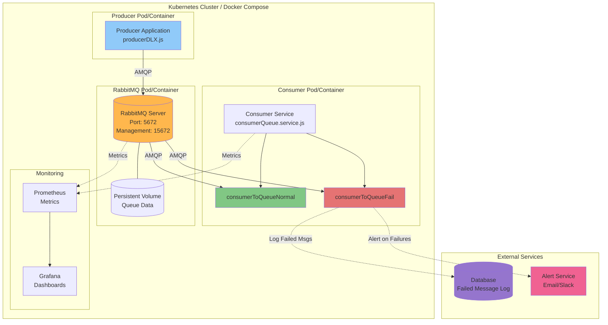

---

## Message Headers & Metadata

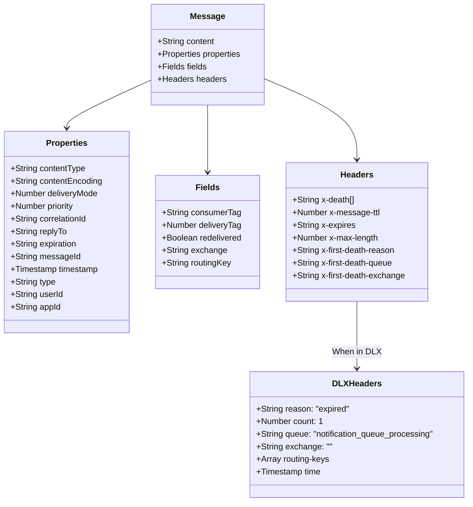

---

## How to View These Diagrams

### Option 1: GitHub/GitLab
- Push this file to GitHub/GitLab
- Mermaid diagrams render automatically

### Option 2: VS Code
- Install "Markdown Preview Mermaid Support" extension
- Open this file and preview (Ctrl+Shift+V)

### Option 3: Online Mermaid Editor
- Visit: https://mermaid.live/
- Copy/paste any diagram code

### Option 4: Export as Images
- Use Mermaid CLI: `mmdc -i input.md -o output.png`

---

## Diagram Legend

| Color | Meaning |
|-------|---------|
| Blue | Producer/Publisher components |
| Yellow/Orange | Normal Exchange & Queue |
| Red/Pink | DLX Exchange & Queue |
| Green | Successful processing |
| Light Orange | Triggers/Conditions |

| Line Style | Meaning |
|------------|---------|
| Solid → | Normal message flow |
| Dashed -.-> | Error/DLX routing |
| Bold ====> | Critical path |

---

## Related Documentation

- Main Documentation: [RabbitMQ_DLX_Implementation.md](RabbitMQ_DLX_Implementation.md)
- Producer Code: [api-nodejs/tests/message_queue/rabbitMQ/producerDLX.js](../api-nodejs/tests/message_queue/rabbitMQ/producerDLX.js)
- Consumer Code: [sys-message-queue/src/services/consumerQueue.service.js](../sys-message-queue/src/services/consumerQueue.service.js)
